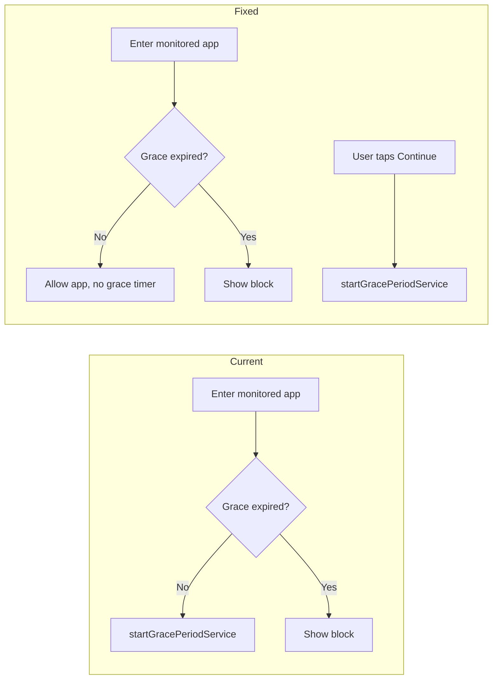

# Block screen fixes

## 1. Grace period only after "Continue"

**Problem:** The grace period timer starts whenever the user enters a monitored app and grace has not expired—including when they simply open the app from the launcher or another app. It should start only when the user has explicitly tapped "Continue" on the block screen.

**Cause:** In [ChillpillAccessibilityService.kt](app/src/main/java/com/chillpill/service/ChillpillAccessibilityService.kt), both paths start the grace service:

- **Correct:** "User returned from our block" (lines 87–93) when `lastPackage == applicationContext.packageName` — this is when they tapped Continue.
- **Incorrect:** "Entering monitored app from elsewhere" when grace has not expired (lines 110–111) — we call `startGracePeriodService` here even though the user never saw the block or tapped Continue.

**Change:** In `processEvent()`, in the "Entering monitored app from elsewhere" branch, when `!graceExpired` do **not** call `startGracePeriodService`. Only call `updateLastAndForeground(pkg, className)` so the app is allowed without starting the grace timer. The grace countdown will then run only when the user has come from the block screen via "Continue" (the existing branch at 87–93).

---

## 2. Smooth overlay animation

**Problem:** The overlay that drains as the wait timer progresses moves in visible steps (chunky) because progress is updated every 100 ms in the ViewModel.

**Cause:** [AppBlockViewModel.kt](app/src/main/java/com/chillpill/ui/appblock/AppBlockViewModel.kt) updates `_progress` every `tickMs = 100L`. The UI in [AppBlockScreen.kt](app/src/main/java/com/chillpill/ui/appblock/AppBlockScreen.kt) uses `Modifier.fillMaxHeight(1f - progress)` directly, so the height jumps every 100 ms.

**Change:** In [AppBlockScreen.kt](app/src/main/java/com/chillpill/ui/appblock/AppBlockScreen.kt):

- Derive an animated value from `progress` with `animateFloatAsState(targetValue = progress, animationSpec = tween(durationMillis = 100))` so the overlay height interpolates smoothly between updates.
- Use this animated value for the overlay’s `fillMaxHeight(1f - animatedProgress)` (and keep using raw `progress` only where needed for phase/card logic).
- Add the Compose animation import; the BOM may already provide it, otherwise add `androidx.compose.animation:animation` (or use `androidx.compose.animation.core.tween` from the core library).

Result: overlay drains smoothly between each 100 ms tick instead of jumping.

---

## 3. Use block activity background image

**Problem:** The block screen should use the provided background image instead of the current drawable.

**Current:** [AppBlockScreen.kt](app/src/main/java/com/chillpill/ui/appblock/AppBlockScreen.kt) loads the background via `rememberBlockBackgroundPainter()` which uses `R.drawable.block_background`. [block_background.xml](app/src/main/res/drawable/block_background.xml) is a solid `#1A1A1A` rectangle. The asset you want is at [app/src/main/res/drawable/block_activity_background.jpg](app/src/main/res/drawable/block_activity_background.jpg).

**Change:** In `rememberBlockBackgroundPainter()`, replace `R.drawable.block_background` with `R.drawable.block_activity_background`. No other change is required: `getDrawable()` works for the JPEG (BitmapDrawable with intrinsic dimensions), and the existing bitmap/painter logic and `ContentScale.Crop` will display it full-screen as the background.

---

## 4. Continue must launch the target app (not Chillpill MainActivity)

**Problem:** When the user taps "Continue" on the block screen, sometimes Chillpill's MainActivity opens instead of the app they were trying to use.

**Cause:** On `RequestFinish`, [AppBlockActivity.kt](app/src/main/java/com/chillpill/AppBlockActivity.kt) only called `finish()`. The block activity was started with `FLAG_ACTIVITY_NEW_TASK` (and the target app was never brought to the foreground—we intercepted and showed the block). So when the activity finishes, the system shows whatever is next in the task (e.g. Chillpill MainActivity or launcher) instead of the intercepted app.

**Change:** On `RequestFinish`, explicitly launch the target app then finish. In [AppBlockActivity.kt](app/src/main/java/com/chillpill/AppBlockActivity.kt): add `launchTargetAppAndFinish()` that builds an intent from `EXTRA_PACKAGE_NAME` and optional `EXTRA_CLASS_NAME`—if `className` is present use `Intent().setClassName(packageName, className)`, otherwise `packageManager.getLaunchIntentForPackage(packageName)`—add `FLAG_ACTIVITY_NEW_TASK | FLAG_ACTIVITY_CLEAR_TOP`, call `startActivity(launchIntent)`, then `finish()`. Handle failures (e.g. app uninstalled) with try/catch and still call `finish()`.

---

## Files to modify

| File                                                                                                         | Change                                                                                                                                                       |
| ------------------------------------------------------------------------------------------------------------ | ------------------------------------------------------------------------------------------------------------------------------------------------------------ |
| [ChillpillAccessibilityService.kt](app/src/main/java/com/chillpill/service/ChillpillAccessibilityService.kt) | In the "Entering monitored app from elsewhere" branch, when `!graceExpired`, remove the `startGracePeriodService` call; only call `updateLastAndForeground`. |
| [AppBlockScreen.kt](app/src/main/java/com/chillpill/ui/appblock/AppBlockScreen.kt)                           | Use `animateFloatAsState(progress, tween(100))` for overlay height; switch background drawable to `R.drawable.block_activity_background`.                    |
| [AppBlockActivity.kt](app/src/main/java/com/chillpill/AppBlockActivity.kt)                                    | On `RequestFinish`, call `launchTargetAppAndFinish()` to explicitly launch the target app (packageName/className) then `finish()`, so the target app opens instead of MainActivity or launcher. |

No new files; no changes to [GracePeriodService.kt](app/src/main/java/com/chillpill/service/GracePeriodService.kt) or [AppBlockViewModel.kt](app/src/main/java/com/chillpill/ui/appblock/AppBlockViewModel.kt) required for these fixes.