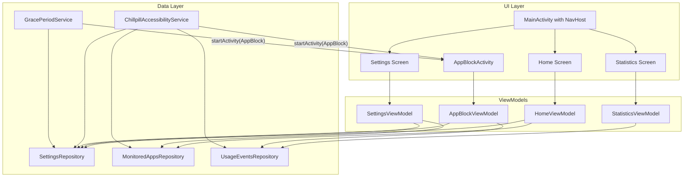

# Chillpill — Design Document

This document describes the app’s architecture, data model, screens, and key technical decisions. Feature specs (per [spec-first](../.cursor/rules/spec-first.md)) reference it so implementation stays consistent.

---

## 1. Document purpose and audience

- **Purpose**: Describe the app’s architecture, data model, screens, and key technical decisions so that feature specs can reference it and implementation stays consistent.
- **Audience**: Developers implementing the app; each feature will get its own `specs/[feature-name].md` (Proposal, Design, Tasks) before code.

---

## 2. Design document structure and content

### 2.1 Overview and goals

- **Product name**: Chillpill.
- **Goal**: Help users limit screen time by intercepting access to selected “monitored” apps and enforcing a wait period before use, plus a time-limited “grace period” per session.
- **Core loop**: User opens monitored app → Block screen (wait X seconds) → User chooses “Continue” or “Home” → If Continue, user has Y minutes of use → After Y minutes, Block screen again (repeat).
- **Target**: Android; UI in Jetpack Compose (see [compose-ui SKILL](../.cursor/skills/compose-ui/SKILL.md) for state hoisting, theming, performance).

### 2.2 Architecture

- **Pattern**: Single-activity navigation with Compose; MVVM per screen.
- **Layers**:
  - **UI**: Composables (stateless where possible), ViewModels (screen state + events).
  - **Domain**: Use cases only if logic becomes non-trivial (e.g. “should show block for this app”).
  - **Data**: Repositories; data sources (DataStore for settings, Room or DataStore for usage stats, system APIs for app list and usage).
- **App usage detection and interception** (aligned with reference: One Sec’s AccessibilityService + BlockActivity flow): Use an **AccessibilityService** to listen for app switches and show the block screen. A separate **foreground service** (grace-period timer) runs only while the user is inside a monitored app after passing the block; when the grace time expires, it starts AppBlockActivity again. See **2.2.1** for the detailed blocking flow.
- **Navigation**: One Activity (e.g. `MainActivity`) hosting NavHost; AppBlockActivity is a **separate Activity** (full-screen, over other apps) so it can appear on top of the monitored app. Main Activity handles: Home, Settings, Statistics, and any permission/fix-permissions flows.

#### 2.2.1 Blocking flow (aligned with reference: listen for apps opened, intercept)

- **Detection mechanism**: **AccessibilityService** (not UsageStatsManager). It receives `AccessibilityEvent` when window state changes. Configure in code (e.g. in `onServiceConnected`):
  - **Event type**: `TYPE_WINDOW_STATE_CHANGED` (value 32) so the service is notified when the foreground app/activity changes.
  - **Package names**: Set `serviceInfo.packageNames` to the list of **all installed app package names** (from PackageManager or a “get installed apps” helper) so the service receives events for any app, not only Chillpill.
  - **Feedback type**: e.g. `FEEDBACK_GENERIC` (16) as needed.
- **In-memory state in the service**: Keep **last foreground package** (and optionally **last class name**). Update this on every relevant event; use it to decide “new app” vs “same app” and to pass into BlockActivity.
- **Event handling** (each `AccessibilityEvent` with package and class):
  1. **Ignore** if `event.getPackageName()` or `event.getClassName()` is null.
  2. **Internal activity switch**: If the transition is from `lastApp` to a known “internal” target (e.g. in-app browser, WebView, system chooser), treat it as same app and do **not** show block. Maintain a small map or set of “internal” package transitions so opening a browser from inside a monitored app does not count as leaving the app.
  3. **New app**: Consider it a “new app” only if the event’s package is **different** from `lastApp`. If same as `lastApp`, skip (no block).
  4. **Content change type**: Ignore events with `getContentChangeTypes()` equal to the “pane disappeared”–style value (e.g. 32) to avoid false triggers on UI updates rather than real app switches.
  5. **Leaving a monitored app**: When `lastApp` is a monitored package and the new event’s package is different: record “app closed” (e.g. update “latest closing time” for that package); **pause** the grace-period timer service if it is running.
  6. **Entering a monitored app**: When the event’s package is in the monitored set: record “app open attempt”; **resume** the grace-period timer service. **Show block** only if all of: (a) **Intentional app switching expired** — e.g. latest closing time + grace duration < now; (b) **App is currently blocked** — user has not yet completed the required wait for this session; (c) **Previous app is not Chillpill** — `lastApp != applicationId` so we don’t re-show block when returning from our own BlockActivity. If all hold: **start BlockActivity** (see below), then update `lastApp` to the current package.
  7. **After processing**: Set `lastApp` (and optionally last class name) to the **current** event’s package (and class).
- **Starting the block screen**: From the AccessibilityService, start **AppBlockActivity** with **Intent flags**: `FLAG_ACTIVITY_NEW_TASK | FLAG_ACTIVITY_CLEAR_TOP | FLAG_ACTIVITY_NO_HISTORY`. **Extras**: `packageName` (String), `className` (String, optional). Optionally a boolean “activate re-intervention / grace shield” so the Block UI can distinguish first wait vs grace-expired.
- **BlockActivity behavior**: Full-screen; `FLAG_KEEP_SCREEN_ON`; read `packageName` and `className` from intent; back press → send user to **Home** (Intent `MAIN` + `CATEGORY_HOME`, `FLAG_ACTIVITY_NEW_TASK`, then `finish()`); `onUserLeaveHint` → `finish()`.
- **Grace period (re-intervention)**: A **foreground service** (separate from the AccessibilityService) runs only while the user is “in” a monitored app after passing the block: **Start/Resume** when the user entered a monitored app (and we did not show block); **Pause** when the user left that app (e.g. via `startForegroundService` with action `PAUSE`); when the timer reaches the grace period, start **AppBlockActivity** with the same package/class and re-intervention flag, then **stopSelf()**. Use the same intent flags so Block appears on top.
- **Fallback**: If on some devices starting an Activity from the AccessibilityService is restricted, document that a fallback (e.g. overlay or UsageStatsManager-based service) could be added later; the primary design follows the reference flow above.

### 2.3 Data model

- **Settings** (persisted, e.g. DataStore):
  - `waitTimeSeconds: Int` — required wait before opening a monitored app.
  - `gracePeriodMinutes: Int` — allowed usage time per “session” after wait.
- **Monitored applications** (persisted):
  - Set of package names (e.g. `Set<String>`), or list of `MonitoredApp(packageName, label)`.
  - Stored via DataStore or Room; label can be resolved from `PackageManager` when needed for UI.
- **Usage events** (for blocking logic and statistics):
  - At least: `packageName`, `timestamp`, `eventType` (e.g. `OPEN_ATTEMPT`, `WAIT_COMPLETED`, `CONTINUED`, `LEFT_APP` or session end).
  - Optional: `sessionStartTime`, `waitCount` per session, for richer stats.
  - Persisted (Room or simplified with DataStore/JSON) so Statistics and “opens in last 24h” can be computed.
- **In-memory / runtime**:
  - In the **AccessibilityService**: current “last” foreground package (and optionally class name) from the last processed event.
  - For each monitored app: “block start” timestamp, “latest open attempt”, “latest closing time” (and optionally “ignore intentional app switching”) so the service can compute “app currently blocked” and “intentional app switching expired”.
  - In the **grace-period service**: elapsed time and the package/class for which the grace timer is running; start/pause/expiry as in 2.2.1.

### 2.4 Screens and features

- **Main (Home) screen**
  - Title (“Chillpill” or similar).
  - Buttons: Settings, Fix Permissions, Statistics.
  - Alert/banner when required permissions are missing (e.g. “Usage access”, overlay if used).
  - No deep navigation from here; buttons navigate to Settings, Statistics, or trigger permission flows.
- **AppBlockActivity**
  - Shown when user opens a monitored app and must wait (or when grace period expired).
  - Background: “funny” image (asset or drawable); tone playful to reduce friction (see [frontend-design SKILL](../.cursor/skills/frontend-design/SKILL.md) for bold aesthetic choices).
  - Animation: progress of wait time (e.g. circular or linear countdown) so user sees time remaining.
  - When timer ends: show “Opened this app N times in the last 24 hours”, plus two buttons: “Continue to app”, “Back to Home”.
  - State: wait phase vs. completed (show stats + buttons); ViewModel holds remaining seconds and drives animation.
- **Settings screen**
  - Input: wait time (seconds); input: grace period (minutes). Values persisted when changed; invalid or empty values reset to defaults on focus loss.
  - List of installed apps with checkboxes; selected items = monitored set. Persist by package name when toggled (no Save button).
  - Back or up to return to main.
- **Statistics screen**
  - List (or top-N) of monitored apps with: times opened (and optionally “times waited and continued”) in a chosen interval (e.g. last 24h or last 7 days). Data from UsageEventsRepository.

UI guidelines for all Compose screens (from compose-ui skill): state hoisting (value + onEvent), root `modifier: Modifier = Modifier`, `MaterialTheme` for colors/typography, ViewModel as single source of truth for screen state.

### 2.5 Key flows

- **Enable monitoring**: User enables the **AccessibilityService** for Chillpill in system Settings (and grants any other required permissions) → Main shows no permission alert → Service receives `TYPE_WINDOW_STATE_CHANGED` events for all installed apps.
- **Opening a monitored app**: AccessibilityService receives an event with a monitored package; if “new app” and not internal switch and not from Chillpill, checks “intentional app switching expired” and “app currently blocked” → if both true, starts AppBlockActivity with `packageName` and `className`. Activity shows wait UI; when done, shows 24h open count + Continue/Home. Continue: finish AppBlockActivity and record session start (and start/resume grace-period service); Home: finish and send user to launcher (MAIN + HOME intent).
- **Grace period**: When user taps “Continue”, grace-period **foreground service** starts/resumes for that package. Service runs a timer; when elapsed ≥ grace minutes, starts AppBlockActivity again (with re-intervention flag), then stops. When user leaves the monitored app, AccessibilityService sends “pause” to the service.
- **Permissions**: “Fix Permissions” opens the relevant system settings (e.g. Accessibility → Chillpill); main screen reflects permission state so the alert can hide when the service is enabled.

### 2.6 Permissions and system integration

- **AccessibilityService**: Declare the service in the manifest with `BIND_ACCESSIBILITY_SERVICE`; provide an `accessibility_service_config.xml` (or configure in code in `onServiceConnected`) with `android:packageNames` (or set at runtime to all installed apps), `android:eventTypes="windowStateChanged"`, `android:feedbackType`, and `android:canRetrieveWindowContent` as needed. User must enable the service in **Settings → Accessibility → Chillpill**; “Fix Permissions” can deep-link to the accessibility settings.
- **FOREGROUND_SERVICE** (and type per SDK): For the **grace-period** service that runs only while the user is in a monitored app after passing the block.
- **POST_NOTIFICATIONS** (SDK 33+): If a notification is shown for the grace-period foreground service.
- **PACKAGE_USAGE_STATS**: Optional; only if adding usage-history or statistics that need it; not required for the core blocking flow, which uses AccessibilityService for detection.

### 2.7 File and module structure (suggested)

- `app/` (application module):
  - `MainActivity` (Compose, NavHost for Home / Settings / Statistics).
  - `AppBlockActivity` (full-screen Compose, no NavHost).
  - **AccessibilityService** (e.g. `ChillpillAccessibilityService`): listens for `TYPE_WINDOW_STATE_CHANGED`, maintains `lastApp` / last class, applies event filters (internal switch, new app, content change), decides when to show block and when to pause/resume the grace service; starts AppBlockActivity with the correct flags and extras.
  - **Grace-period foreground service** (e.g. `GracePeriodService` or `ReInterventionService`): started/resumed when user is in a monitored app after passing block; paused when user leaves; when timer reaches grace duration, starts AppBlockActivity with re-intervention flag and stops.
- Packages (example): `ui.home`, `ui.settings`, `ui.statistics`, `ui.appblock`; `data.settings`, `data.monitored`, `data.usage`; `service` (accessibility + grace service); `domain` if use cases are introduced.
- Each feature gets a spec under `specs/` (e.g. `specs/main-screen.md`, `specs/app-block.md`, `specs/settings.md`, `specs/statistics.md`, `specs/accessibility-service.md`, `specs/grace-period-service.md`) per spec-first rule before implementation.

### 2.8 Out of scope for the design doc (can be brief)

- Exact wait/grace defaults (e.g. 10 s and 5 min) — can live in a config or Settings spec.
- Off-the-shelf analytics or crash reporting.
- Backup/restore of monitored list (can be added later).

---

## 3. Next steps

- Create per-feature specs under `specs/` (main-screen, app-block, settings, statistics, accessibility-service, grace-period-service) with Proposal / Design / Tasks before any implementation.

---

## 4. Summary

| Section        | Content                                                                                                                                       |
| -------------- | --------------------------------------------------------------------------------------------------------------------------------------------- |
| Overview       | Product goal, core loop, Compose + MVVM                                                                                                       |
| Architecture   | Layers; **AccessibilityService** for detection/interception; separate **grace-period service**; AppBlockActivity as separate Activity (2.2.1) |
| Data model     | Settings, monitored apps, usage events; lastApp/block state and grace timer in memory                                                         |
| Screens        | Main (home), AppBlock, Settings, Statistics with responsibilities                                                                             |
| Flows          | Enable a11y service; event handling → block decision → start BlockActivity; grace service start/pause/expiry                                  |
| Permissions    | AccessibilityService (manifest + config); foreground service + notifications                                                                |
| File structure | AccessibilityService + GracePeriodService; packages and suggested specs                                                                        |

This gives the team a single reference for “how Chillpill is structured” and keeps feature specs and code aligned with the same architecture and data model.
